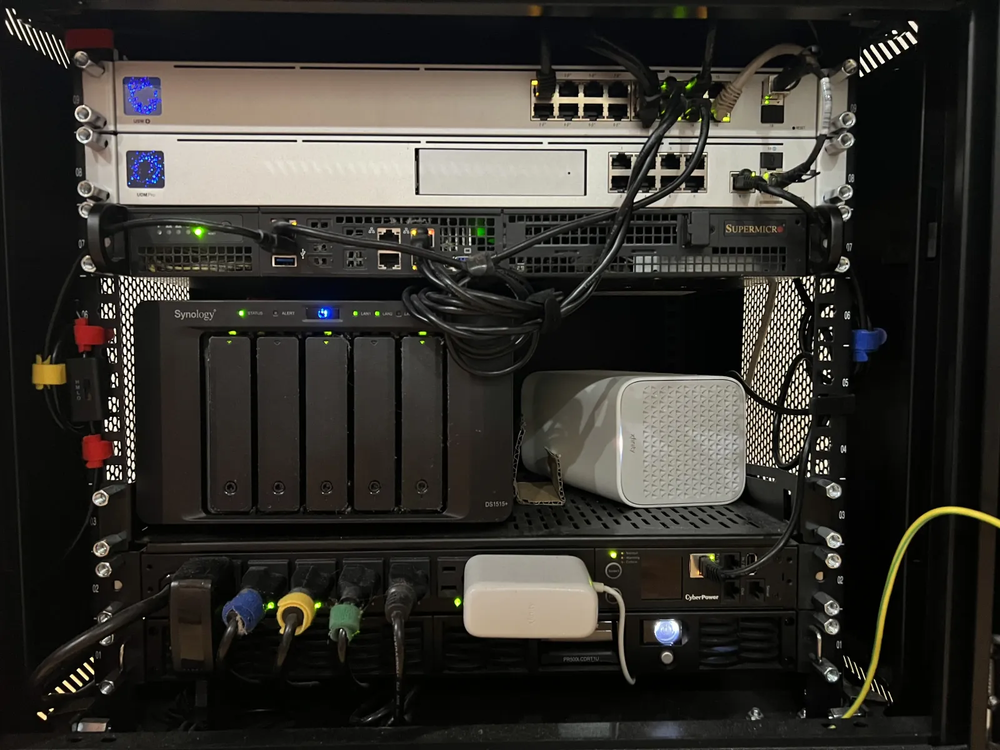
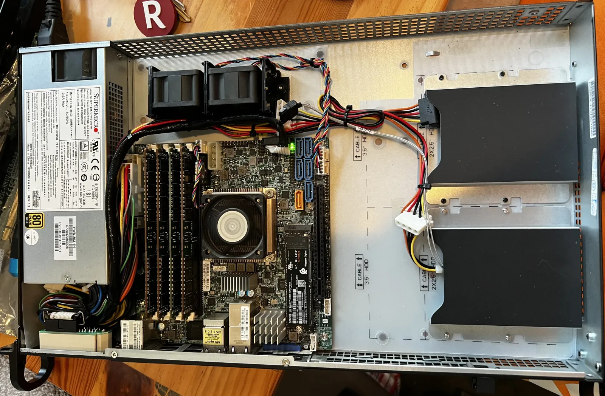
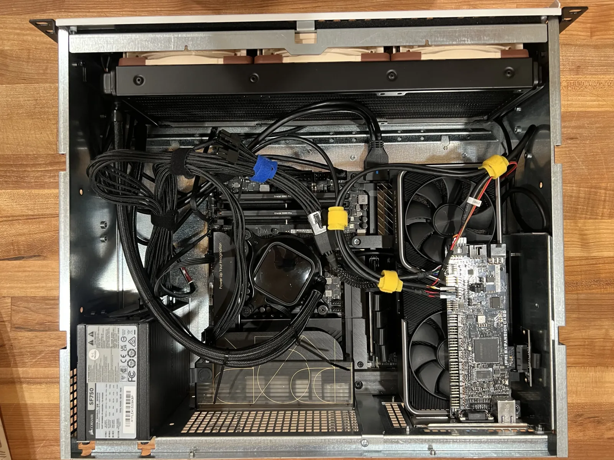
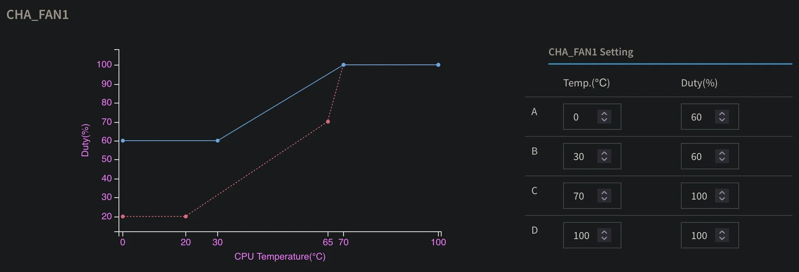
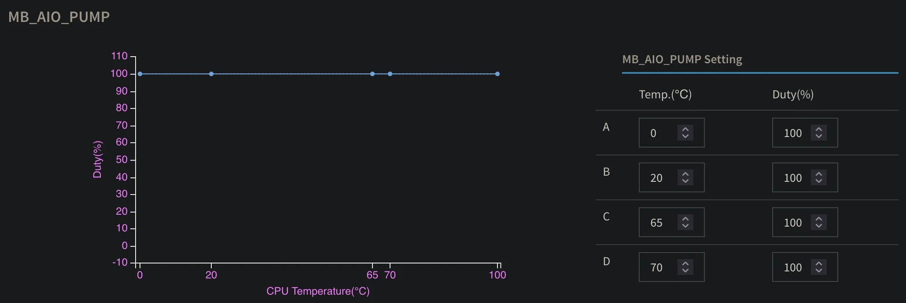
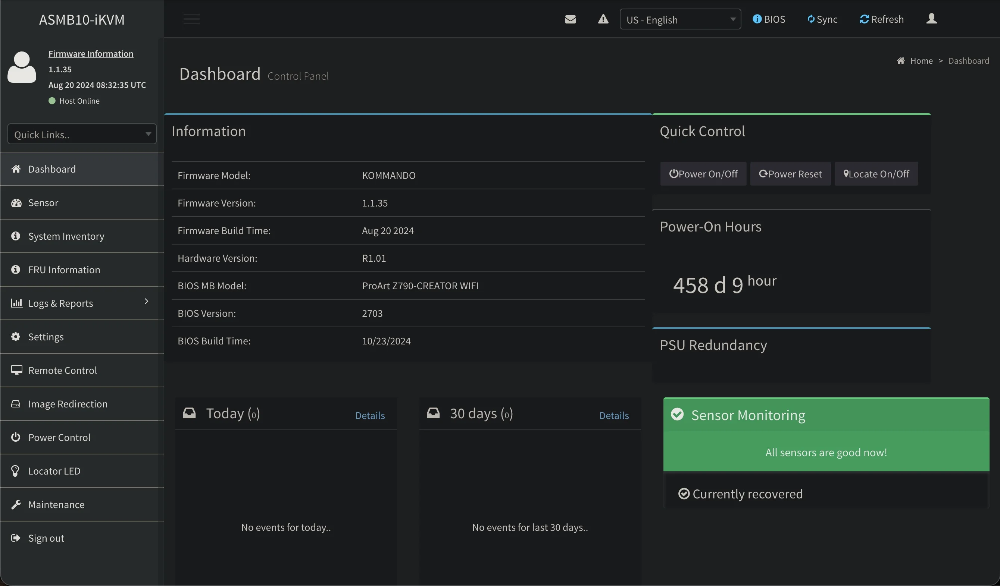
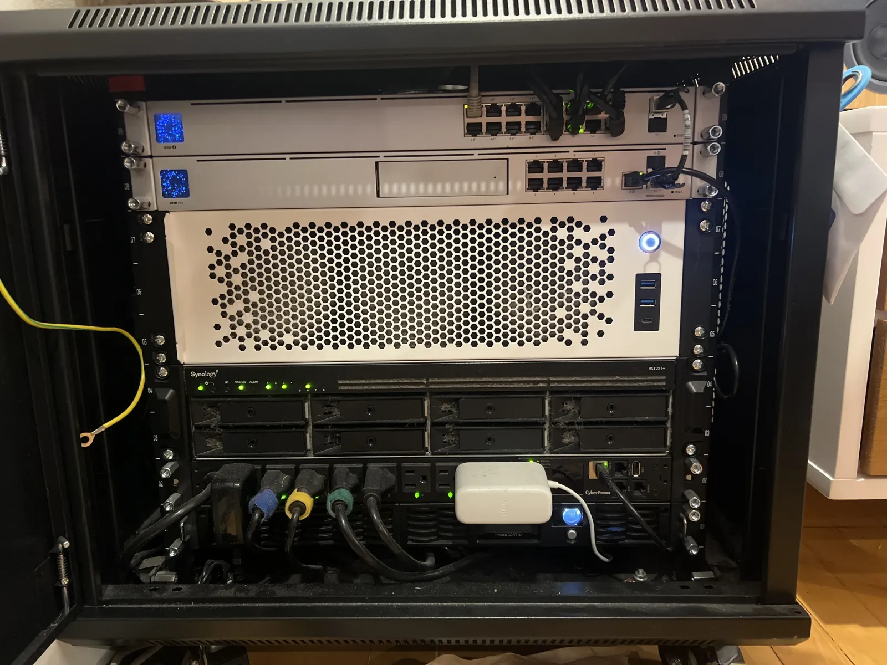

With the recent release of Hades II public beta, my interest in building a gaming computer has metastasized beyond purely the academic.
As much as I love beautiful minimalist gaming PC cases, I'm a pragmatist at heart and I can't conscience an exorbitantly priced paper weight, should I fail to live up to my gaming ambitions.
Luckily, I had a second bird in the bush to kill with my stone, Lore.

I've been meaning to upgrade my Docker application server for a while.
Since 2016 I've been rocking a Supermicro X10SDV-TLN4F-O in a Supermicro CSE-505-203B 1U chassis.
This thing, with its 8-core Intel&reg; Xeon&reg; D-1451, is no joke especially with a nice helping of 128GiB ECC DDR4 memory.
However, one thing that's not a joke are the three Supermicro FAN-0061L4 fans with a max speed of 13,000 RPM.

All was fun and games, living with what at idle sounded like a small bee hive in my living room.
However, once I stood up a Minecraft server for myself and my friends, the relatively low single-core clock speed (2.1GHz) combined with the 40mm fan form factor quickly lead to, as my partner so lovingly described, an urgently untenable situation.
Once I started investigating its performance, I noticed several IPMI alerts from over the years of **critical CPU temps over 80°C** which were never delivered over e-mail due to a misconfiguration.

## The Specs
Lore, much like its Star Trek namesake, was destined to return after a brief demise with a few major upgrades.
Specifically, I'm looking for:

**0. A Larger Form Factor.**
The 1U restriction is the heart of my issues here.
40mm ain't much to work with, so allowing 3U or 4U means larger fans and therefore more mass airflow per revolution of the blades.
The added headroom also means I can use an active CPU cooler, rather than relying on a heat sink.
With these changes, my server should run both cooler and quieter.

**1. Intel QuickSync Video.**
This was a major flaw of my setup, which hosts Plex.
The Intel Xeon D-1541 lacks an <abbr title="Integrated Graphical Processing Unit">iGPU</abbr>, so any transcoding by Plex is brute forced by the CPU at quite the efficiency cost.
Anytime video was transcoding, the server's noise level would increase dramatically.
Normally, this could be resolved by the addition of a discrete GPU.
However, Intel <abbr title="QuickSync Video">QSV</abbr> is unbelievably efficient at transcoding H.264 and H.265 content.
This means an iGPU can transcode for Plex faster than a discrete GPU and with less energy consumption.

**2. A Honkin' GPU.**
Adding a GPU to my setup was obviously essential for my gaming dreams.
What remained non-obvious was how to cram a full height graphics card into 3U or 4U.
Thankfully, Sliger came to my rescue with the Sliger CX3150a.
This beast boasts a 4U form factor with room for a full height GPU via PCIe riser.
Now, this would have been enough but this fantastic machine also supports 120mm AIO cooling, a novelty in rack-mount hardware that's sure to get the most out of my CPU.

**3. Out of Band Management.**
IPMI was perhaps one of my favorite features of my Supermicro setup.
The ability to remotely fix startup issues, apply firmware updates, and see dmesg while booting saved my ass on numerous occasions.
Per Murphy's Law, the day after I leave for vacation is usually when these issues crop up.

**4. Thunderbolt.**
This one is really out there, and more than a few people told me I was crazy.
Since my motivation behind this adventure was mainly gaming, I wanted to be able to game from my dual monitor desk setup.
The tricky part is my desk is downstairs and my server rack upstairs.
Running <abbr title="Keyboard Video Mouse">KVM</abbr> + audio over 50 feet is tricky business.
This stretches the limit of the USB specification and I desperately wanted to avoid running 5 cables for this.
In theory, one could operate such a setup over USB 3.2 using a dock, but bandwidth limitations won't allow two 4k monitors at 120Hz.

Amazingly, there exists a solution though somewhat ludicrous: Corning manufactures fiber optic Thunderbolt 3 cables up to 300 feet.
With Thunderbolt, I can run one absurdly thin cord to the dock at my desk and power my keyboard, mouse, displays, and miscellaneous peripherals with room to grow.

## Finding Perfect Parts
Making a list of requirements is the easy part. Building a parts list that met them proved immensely difficult. I waited 3 years after I had this idea for the right collection of parts to come on the market, namely the [ASUS ProArt Z790-CREATOR WIFI](https://www.asus.com/us/motherboards-components/motherboards/proart/proart-z790-creator-wifi/) motherboard which supports Thunderbolt, Intel QSV, and allows for first-party IPMI.

| Part | Spec | Name |
|:-----|:-----|:-----|
| Motherboard | LGA 1700 | [ASUS ProArt Z790-CREATOR WIFI](https://www.asus.com/us/motherboards-components/motherboards/proart/proart-z790-creator-wifi/) |
| CPU | 5.1 GHz | [Intel Core i5-13600K](https://ark.intel.com/content/www/us/en/ark/products/230493/intel-core-i5-13600k-processor-24m-cache-up-to-5-10-ghz.html) |
| Memory | 32 GB | [Crucial Pro DDR5-5600](https://www.crucial.com/memory/ddr5/cp32g56c46u5) |
| SSD | 4 TB | [Samsung 990 EVO Plus](https://www.samsung.com/us/memory-storage/nvme-ssd/990-evo-plus-gen4-nvme-ssd-4tb-sku-mz-v9s4t0b-am/) |
| GPU | 8 GB | [NVIDIA GeForce RTX 3070](https://www.nvidia.com/en-us/geforce/graphics-cards/30-series/rtx-3070-3070ti/) |
| Chassis | 3U | [Sliger CX3150a](https://www.sliger.com/products/rackmount/3u/cx3150a/) |
| OOBM | IPMI 2.0 | [ASUS IPMI Expansion Card](https://uk.store.asus.com/rog/catalog/product/view/id/9999) |
| Cooling | 360 mm | [Asetek 636S](https://www.asetek.com/liquid-cooling/gaming-enthusiasts/cpu-cooling/gen6-mainstream-cpu-coolers/) |
| PSU | 750 W | [Corsair SF750 80 PLUS Platinum](https://www.corsair.com/us/en/p/psu/cp-9020186-na/sf-series-sf750-750-watt-80-plus-platinum-certified-high-performance-sfx-psu-cp-9020186-na) |

## The Build
This was absolutely the most fun part of this whole experience. It's certainly a tight fit in this 3U chassis and I had to get creative. Cramming the GPU and IPMI card in the vertically stacked expansion slots required a x16 PCIe riser cable _and_ a x4 PCIe riser for the IPMI card. Wiring got to be quite complicated but I'm proud of the cable management--though the airflow through the GPU fans is partially obstructed. Despite this, the airflow through the chassis via the 360mm AIO with Noctua fans is radically effective at cooling both the CPU and GPU.

## Outcome
This upgrade yielded _tremendous_ improvements. First and foremost, the miniature jet engine in my living room was replaced by an imperceptible hum. With some fine tuning, I was able to completely max out the CPU with `stress -n 16` unable to push CPU temps over 40°C with this modest fan curve. This means the Noctua fans run at 60% and are completely inaudible, with my iPhone registering no change to the ambient sound levels in the room. I did listen to the fans at 100% just to hear it--and it's about as loud as the fan mounted at the top of my rack for ventilation.

Of course, the AIO pump is run at 100%.

And the best part: all of this was configurable remotely via IPMI, where I can access settings, sensor readings, and an HTML5 remote KVM.

As a bonus:
- All of my CPU load driven by Plex transcoding fell off, now delegated by the iGPU
- I have 4TB of SSD space to use as `/dev/shm` for hosting low-latency Minecraft worlds and fast storage for Usenet article downloading and unpacking.
- Through Docker, I can host a KDE desktop and play Steam games via Proton from my desk with near-zero latency over Thunderbolt.
- Over the LAN, I can play containerized Steam games with 7ms latency to my Steam Deck over wired LAN and 20ms over 5GHz WLAN via Moonlight.
- Remote access to my host via IPMI and _properly configured_ e-mail alerts for any future sensor abnormalities.

That last point--running a full Steam library from inside a container and streaming it across the house--turned into a rabbit hole deep enough to deserve its own post. Coaxing GPU access, Proton, and Moonlight into cooperating inside Docker was equal parts miraculous and cursed, and I'll get into how the whole thing fits together in a follow-up.

Lore has been humming along quietly ever since. What started as a noise complaint became the most capable machine I've ever run: transcoding for Plex, hosting Minecraft worlds, and doubling as a gaming rig, all from three feet away without anyone in the room noticing it's powered on.

I've yet to play Hades II.
