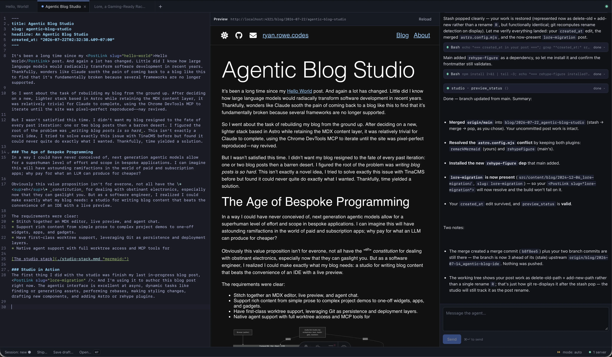
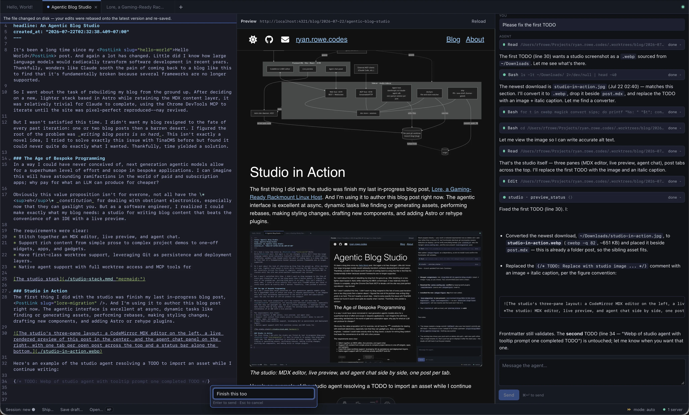
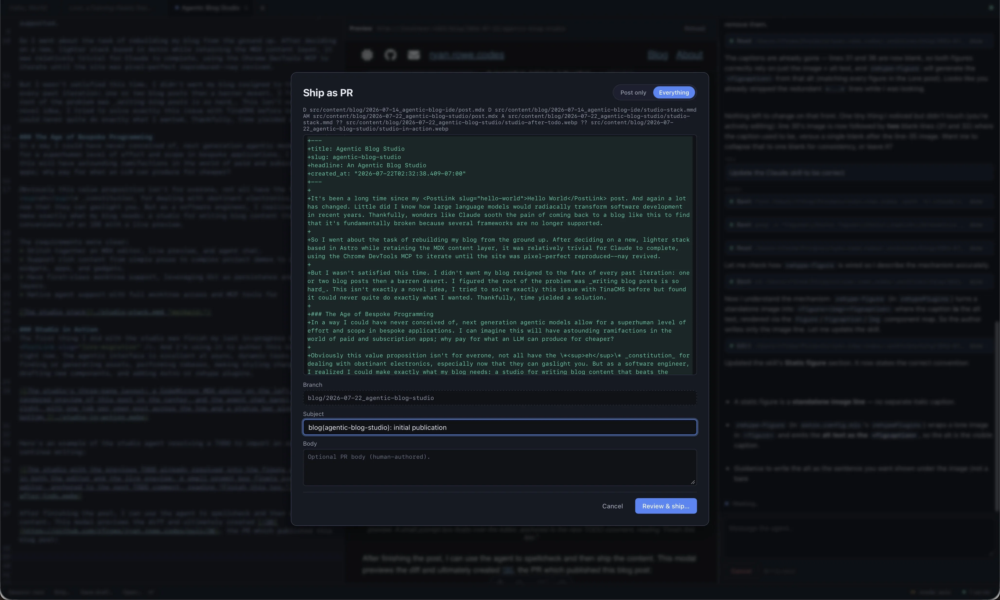

It's been a long time since my <PostLink slug="hello-world">Hello World</PostLink> post. And again a lot has changed. Little did I know how large language models would radiacally transform software development in recent years. Thankfully, wonders like Claude sooth the pain of coming back to a blog like this to find that it's fundamentally broken because several frameworks are no longer supported.

So I went about the task of rebuilding my blog from the ground up. After deciding on a new, lighter stack based in Astro while retaining the MDX content layer, it was relatively trivial for Claude to complete, using the Chrome DevTools MCP to iterate until the site was pixel-perfect reproduced--nay revived.

But I wasn't satisfied this time. I didn't want my blog resigned to the fate of every past iteration: one or two blog posts then a barren desert. I figured the root of the problem was _writing blog posts is so hard_. This isn't exactly a novel idea, I tried to solve exactly this issue with TinaCMS before but found it could never quite do exactly what I wanted. Thankfully, time yielded a solution.

### The Age of Bespoke Programming
In a way I could have never conceived of, next generation agentic models allow for a superhuman level of effort and scope in bespoke applications. I can imagine this will have astounding ramifactions in the world of paid and subscription apps; why pay for what an LLM can produce for cheaper?

Obviously this value proposition isn't for everone, not all have the \*eh\* _constitution_ for dealing with obstinant electronics, especially now that they can gaslight you. But as a software engineer, I realized I could make exactly what my blog needs: a studio for writing blog content that beats the convenience of an IDE with a live preview.

The requirements were clear:
* Stitch together an MDX editor, live preview, and agent chat.
* Support rich content from simple prose to complex project demos to one-off widgets, apps, and gadgets.
* Have first-class worktree support, leveraging Git as persistence and deployment layers.
* Native agent support with full worktree access and MCP tools for

[The studio stack](./studio-stack.mmd "mermaid:")

### Studio in Action
The first thing I did with the studio was finish my last in-progress blog post, <PostLink slug="lore-migration" />. And I'm using it to author this blog post right now. The agentic interface is excellent at async, dynamic tasks like finding or generating assets, performing rebases, making styling changes, drafting new components, and adding Astro or rehype plugins.

Here's an example of the studio agent resolving a TODO to import an asset while I continue writing:

After finishing the post, I can use the agent to spellcheck and then ship the content. This modal previews the diff and ultimately created [!30](https://github.com/rfrowe/ryan.rowe.codes/pull/30), the PR which published this blog post:

